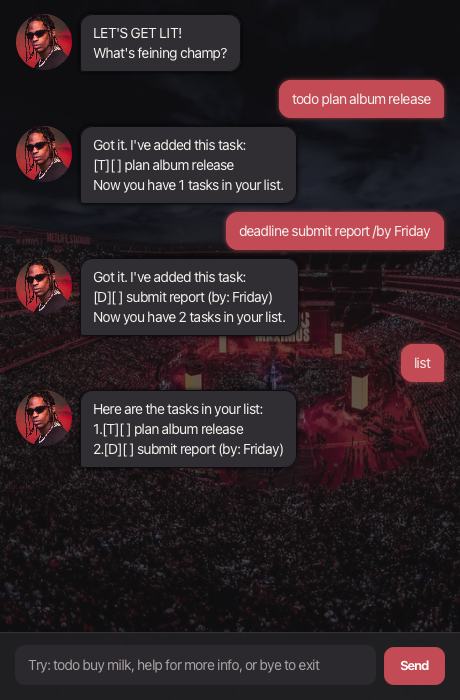

# Fein User Guide

Fein is a stress-free task chatbot with a Travis Scott-inspired interface. Use it to keep track of todos,
deadlines, and events without losing the details that matter.



## Table of contents

- [Getting started](#getting-started)
- [Features](#features)
  - [Add a to-do](#add-a-to-do)
  - [Add a deadline](#add-a-deadline)
  - [Add an event](#add-an-event)
  - [List tasks](#list-tasks)
  - [Find tasks](#find-tasks)
  - [Mark or unmark a task](#mark-or-unmark-a-task)
  - [Delete a task](#delete-a-task)
  - [Show help](#show-help)
  - [Exit Fein](#exit-fein)
- [Duplicate tasks](#duplicate-tasks)
- [Tips and error messages](#tips-and-error-messages)
- [Saving data](#saving-data)

## Getting started

1. Ensure Java 25 is installed.
1. Run the application JAR:

   ```bash
   java -jar fein.jar
   ```

1. Type a command in the input box and press <kbd>Enter</kbd>, or select **Send**.
1. Type `help` at any time to see Fein's command list.

> **Note:** Commands are lowercase. Use one space between command words.

## Features

Use this overview to find a command quickly. Detailed instructions follow below.

| I want to... | Command | Example |
| --- | --- | --- |
| Add a task without a date or time | `todo <description>` | `todo buy milk` |
| Add a due date or time | `deadline <description> /by <due date>` | `deadline submit report /by Friday` |
| Add an event | `event <description> /from <start> /to <end>` | `event team meeting /from 2pm /to 4pm` |
| View saved tasks | `list` | `list` |
| Search tasks | `find <keyword>` | `find report` |
| Update a task | `mark`, `unmark`, or `delete` | `mark 1` |
| Get help or exit | `help` or `bye` | `help` |

### Add a to-do

Adds a task without a date or time.

**Format:** `todo <description>`

**Example:** `todo buy milk`

### Add a deadline

Adds a task with a due date or time.

**Format:** `deadline <description> /by <due date>`

**Examples:**

- `deadline submit report /by Friday`
- `deadline return book /by 2/12/2026 1800`

Numeric dates use `day/month/year`. Fein accepts two- or four-digit years, such as `23/6/26` and
`23/6/2026`. A numeric time uses the 24-hour `HHmm` format.

### Add an event

Adds a task with a start and end time.

**Format:** `event <description> /from <start> /to <end>`

**Examples:**

- `event team meeting /from 2pm /to 4pm`
- `event workshop /from 2/12/2026 1800 /to 2/12/2026 2000`

When both event times use numeric dates and times, the end must be after the start.

### List tasks

Shows every task in your list.

**Format:** `list`

If there are no tasks, Fein displays:

```text
Your list is empty! Try adding a task with `todo <description>`.
Example: todo buy milk
```

### Find tasks

Shows tasks whose descriptions contain a keyword. Matching ignores uppercase and lowercase letters.

**Format:** `find <keyword>`

**Example:** `find report`

### Mark or unmark a task

Marks a task as completed, or changes a completed task back to incomplete.

**Formats:**

- `mark <task number>`
- `unmark <task number>`

**Examples:** `mark 1`, `unmark 1`

Use `list` first if you are unsure of a task number.

### Delete a task

Removes a task permanently from your list.

**Format:** `delete <task number>`

**Example:** `delete 2`

### Show help

Shows all available commands with their purposes and examples.

**Format:** `help`

### Exit Fein

Closes Fein.

**Format:** `bye`

## Duplicate tasks

Fein keeps your list clean by rejecting a task with the same details as one already saved. Duplicate
comparison ignores letter case and completion status:

- A todo duplicates another todo with the same description.
- A deadline also needs the same due date or time to be a duplicate.
- An event also needs the same start and end times to be a duplicate.

For example, after adding the first command below, the second is rejected and the original task remains
unchanged:

```text
todo add report
todo Add report
```

Fein also rejects commands that use repeated spaces between words. This prevents differently spaced input
from being treated as a separate task and keeps command formats predictable:

```text
todo add report
todo add    report
```

The second command receives a spacing-format message; the list is unchanged.

## Tips and error messages

- Use `/by` once for a deadline, and use `/from` before `/to` once each for an event.
- A task description, date, or time cannot contain the `|` character because Fein uses it internally when
  saving tasks.
- Invalid numeric dates, such as `31/6/2026`, are rejected.
- If Fein does not recognise a command, try `todo buy milk`, `list`, or `help`.

## Saving data

Fein saves task changes automatically in `data/fein.txt`. Keep this file if you want your tasks to remain
available the next time you run Fein.
